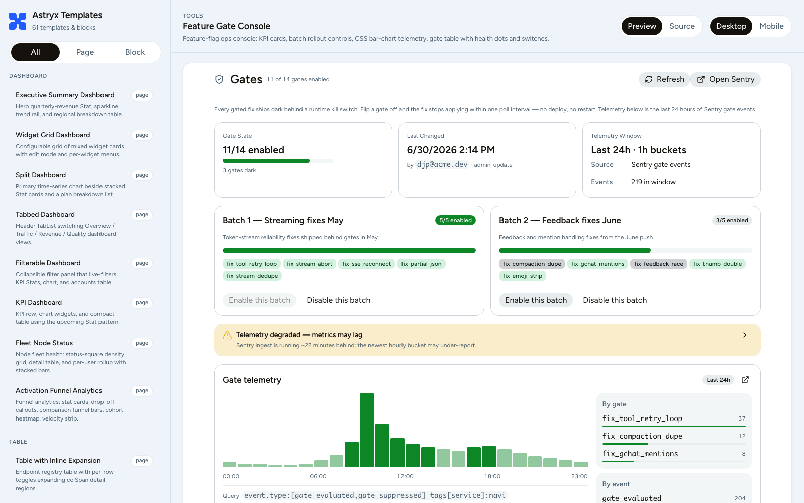

# Astryx Templates

Astryx Templates is an open-source catalog of 69 production-shaped page templates and blocks built with [Astryx](https://astryx.atmeta.com/), React, and Vite, plus a themed gallery for browsing them.

It is a sibling of [astryx-sheet](https://github.com/thedjpetersen/astryx-sheet) and [astryx-editor](https://github.com/thedjpetersen/astryx-editor): where those repos stress-test the design system with one deep interactive surface, this repo stress-tests its breadth — dashboards, dense tool consoles, AI-agent surfaces, settings, onboarding, and shells, each written the way a real product page would be.

## Demo

Live demo: https://thedjpetersen.github.io/astryx-templates/



Every template is deep-linkable — the gallery syncs selection to the URL hash, so `/#feature-gate-console` opens straight to that template with browser back/forward support. Each entry offers preview and source views at desktop and mobile widths.

## Using the templates

Adopt at whatever depth fits:

- Browse the gallery and copy the source of any template — each is a single self-contained `.tsx` file with no cross-template imports.
- Install the package into an Astryx consumer project and copy templates through the CLI.
- Use the templates as reference implementations for the frame-first Astryx layout pattern when writing your own pages.

Register the integration in the consumer's `astryx.config.mjs`:

```js
/** @type {import('@astryxdesign/cli/config').AstryxConfig} */
const config = {
  integrations: ['astryx-templates'],
};

export default config;
```

Then list and copy templates:

```sh
npx astryx template --list --package astryx-templates
npx astryx template feature-gate-console ./src/app/gates
```

The published `@astryxdesign/cli@0.1.2` discovers external block templates through `blocks/`; the upstream integration-template API on `facebook/astryx` discovers page and block templates through `templates/`. This repo keeps both roots so current CLI releases and the incoming API coexist.

## The catalog

**Dashboard**

- `dashboard-executive-summary` — Hero quarterly-revenue Stat, sparkline trend rail, and regional breakdown table.
- `dashboard-widget-grid` — Configurable grid of mixed widget cards with edit mode and per-widget menus.
- `dashboard-split` — Primary time-series chart beside stacked Stat cards and a plan breakdown list.
- `dashboard-tabbed` — Header TabList switching Overview / Traffic / Revenue / Quality dashboard views.
- `dashboard-filterable` — Collapsible filter panel that live-filters KPI Stats, chart, and accounts table.
- `kpi-dashboard` — KPI row, chart widgets, and compact table using the upcoming Stat pattern.
- `fleet-node-status` — Node fleet health: status-square density grid, detail table, and per-user rollup with stacked bars.
- `activation-funnel-analytics` — Funnel analytics: stat cards, drop-off callouts, comparison funnel bars, cohort heatmap, velocity strip.

**Table**

- `table-inline-expansion` — Endpoint registry table with per-row toggles expanding colSpan detail regions.
- `table-index-detail` — Master job table whose selected row populates an end-panel detail pane.
- `table-split-pane` — Email-client split with a resizable ticket list and conversation detail pane.
- `table-bulk-actions` — Checkbox selection with a sticky action bar for archive, assign, and delete.
- `table-tree` — Expandable hierarchical file table with depth indenting and tree-aware search.
- `table-comparison` — Pricing matrix with a frozen label column and scrollable plan columns.
- `table-chart` — Weekly store chart over its product table with metric switch and row overlay.

**Form**

- `form-page` — Centered single-column settings form with grouped sections and sticky footer.
- `form-wizard` — Multi-step setup wizard with step indicator, per-step validation, and review.
- `form-modal` — Create-project Dialog over a dimmed project table, adding rows on submit.
- `form-side-sheet` — Discounts table with a slide-in right sheet for creating or editing a record.
- `form-inline-edit` — Label/value rows that swap into inline inputs with per-row Save/Cancel.

**Shell**

- `shell-left-sidebar` — AppShell with a collapsible grouped SideNav beside a placeholder page.
- `shell-top-nav` — Horizontal TopNav bar over a full-width content area with a placeholder slot.
- `shell-top-nav-sidebar` — Global TopNav plus a contextual SideNav that swaps groups per active section.
- `shell-breadcrumb` — Drill-down shell where a deep Breadcrumbs trail carries all hierarchy.
- `messaging-shell` — Four-column messaging frame with rail, channel list, stream, and thread panel.
- `notification-center` — Navbar bell with unread badge, pinned-open 320px notification popover, corner toast, and state variants.

**AI Chat**

- `ai-chat-artifact` — Conversation panel beside a generated-code artifact pane with version tools.
- `ai-chat-tool-stream` — Agent chat with collapsed tool-call piles expanding into per-call status rows.
- `compaction-inspector` — Compaction event inspector with raw/summary comparison, context tree, and stats.
- `browser-session-replay` — Agent browser-session dock with play/scrub transport, frame counter, and a 12-step action timeline.
- `sub-agent-monitor` — Docked sub-agent status tray with dismiss/restore management and a modal session transcript.
- `composer-state-gallery` — Six frozen states of a power chat composer: slash chip, mentions, queued tray, drag-over, force-stop.
- `artifact-pin-dock` — Pill tab bar with CI status dots over an artifact viewer, GitHub PR card, and a data-sources run panel.

**Tools**

- `inbox` — Three-column mail triage with folder rail, message list, and reading pane.
- `search-results` — Docs search with facet rail, ranked snippet results, sort, and pagination.
- `diff-viewer` — Split/unified code diff with gutters, change stats, and an inline comment thread.
- `notebook-report` — Analytics notebook of prose, SQL, chart, and table blocks with block toolbars.
- `incident-console` — On-call response console with dense grouped rows and a resizable inspector.
- `kanban-board` — Product delivery board with fixed-width columns and accessible move controls.
- `deployment-detail` — Deployment status header, metadata grid, and terminal-style build logs.
- `command-palette-launcher` — Command palette over a dimmed workspace with fuzzy matching and grouped results.
- `file-browser-preview` — TreeList file navigator beside a code/rendered preview with version history.
- `memory-relation-explorer` — Faceted memory-graph browser: filter rail, relation table with weight bars, and a typed detail panel.
- `feature-gate-console` — Feature-flag ops console: KPI cards, batch rollout controls, CSS bar-chart telemetry, gate table with health dots and switches.
- `transcript-annotator` — Session replay transcript with seven block renderers beside a sticky golden/failure/neutral labeling panel.

**Media**

- `podcast-episode-player` — Episode page with synced transcript, chapter rail, and docked audio player bar.
- `video-watch-page` — Watch page with mock player chrome, up-next rail, description, and comments.
- `album-tracklist-player` — Album page with hero, track table, and persistent now-playing bar.
- `streaming-browse-home` — Dark browse home with hero billboard and horizontal poster carousels.
- `live-stream-viewer` — Live player with chat rail, viewer stats, and follow/sub actions.
- `media-asset-pipeline` — Upload/transcode manager with folder tree, status table, and renditions panel.
- `subtitle-cue-editor` — Caption cue table synced to a mock player with timing validation.
- `video-clip-timeline` — NLE-style editor with tool rail, program monitor, and multi-track timeline dock.

**Settings**

- `settings-extension-catalog` — Marketplace grid and installed-extension list with scope badges and switches.
- `settings-secrets-env` — Collapsible sections for masked secrets, webhooks, and repos with confirm flows.
- `scheduled-jobs-manager` — Cron job list with health badges plus a detail pane: execution history, autosave editor, version history.
- `automation-rule-builder` — Hook list with mini switches and a six-color trigger condition editor plus script file tabs.

**Onboarding**

- `onboarding-guided-install` — CLI-node setup stepper with copy commands, waiting/connected status strip, and troubleshooting accordions.
- `cli-pairing-console` — CLI daemon console with mascot header and status-line variants beside a four-state device-authorization card.

**Content**

- `product-list` — Faceted catalog browse with filter rail, results toolbar, and product card grid.
- `profile-page` — Directory profile with identity header, Stat row, and activity/details tabs.
- `timeline` — Chronological activity feed with sticky date headers and event-type filter.
- `infinite-scroll-feed` — Filterable single-column post feed ending in a skeleton loading group.
- `slide-deck-viewer` — PPTX-style viewer: header pager, 112px thumbnail rail, centered 4:3 slide stage from shape fixtures.
- `skill-package-detail` — Package detail: badge-cluster header, file-tab code browser, and version history with inline per-file diffs.

**Operations**

- `operations-dashboard` — Starter dashboard for this package with KPI cards, review queue, and actions.
- `kpi-strip` — Compact metric card strip for dashboard headers.

**Monitoring**

- `logs-explorer` — Facet rail, PowerSearch filters, live-tail switch, and expandable log stream.

**Code**

- `codeblock-terminal` — Dark terminal-style CodeBlock with a syntax theme wrapper.

## Template conventions

What makes these templates different from typical UI-kit demos:

- **Frame-first layout.** Every page starts from `Layout height="fill"` with `LayoutHeader`, `LayoutContent`, and `LayoutPanel` owning the chrome, so only the intended region scrolls — never the page.
- **Deterministic fixtures.** Fixed ISO timestamps, no randomness, no clocks, no network assets, and no credential-shaped strings. A template renders identically on every load, which keeps them safe to diff, screenshot, and copy.
- **Real interactions.** Selection, expansion, tabs, dialogs, optimistic toggles, autosave lifecycles, and validation flows are wired with local state — pages feel alive rather than frozen.
- **Lucide icons throughout.** Templates import semantic `lucide-react` glyphs, and the gallery registers Lucide for all of Astryx's built-in semantic icon names so component internals (chevrons, close buttons, status marks) match.
- **Selection-teaching metadata.** Each template's `.doc.ts` describes the concrete product surface, the layout archetype, and when to choose it over neighboring templates — written for both humans and code-generation agents picking a starting point.
- **Documented responsive contracts.** Every source file's header comment states what hides, wraps, scrolls, or keeps width at each breakpoint.

See [TEMPLATE_GUIDE.md](./TEMPLATE_GUIDE.md) for the authoring pattern.

## Authoring

Each template is a same-stem pair under `templates/`:

```text
templates/
  feature-gate-console.doc.ts
  feature-gate-console.tsx
```

The `.doc.ts` file default-exports Astryx metadata with `type: 'page'` or `type: 'block'`; the `.tsx` file is the single source file Astryx shows or copies. Nested paths become the CLI id (`templates/commerce/product-grid.doc.ts` → `astryx template commerce/product-grid`).

## Getting started

```bash
pnpm install
pnpm demo
```

Then open the Vite URL printed in your terminal.

## Useful commands

```bash
pnpm demo          # run the local template gallery
pnpm check         # validate doc/source pairs + typecheck everything
pnpm build:demo    # production build of the gallery
pnpm deploy:pages  # rebuild docs/ for the GitHub Pages demo
```

## Project structure

```text
templates/                  # page templates: same-stem .doc.ts + .tsx pairs
blocks/                     # legacy block templates for the current CLI release
demo/src/App.tsx            # gallery shell: nav, deep links, preview/source, viewports
demo/src/templateRegistry.tsx  # imports every template + its raw source
demo/src/lucideIcons.tsx    # registers Lucide for Astryx semantic icon names
demo/src/compat/            # shims for unreleased Astryx pieces (Stat, ChartV2, lab)
scripts/validate-templates.mjs # doc/source pairing checks run by pnpm check
docs/                       # built gallery served by GitHub Pages
TEMPLATE_GUIDE.md           # frame-first authoring pattern
```

## Why this exists

Template catalogs are a good stress test for a design system's vocabulary: 69 surfaces force the primitives to cover dashboards, virtual-ops consoles, agent chat, document viewers, and terminal aesthetics without ad hoc CSS escaping the system. The newer batches are modeled on real product surfaces from a working AI-assistant app — sub-agent monitors, memory-graph explorers, eval-labeling consoles, feature-gate ops — so the catalog reflects the shapes modern tools actually take, not idealized demo pages.

The `.doc.ts` metadata layer doubles as a selection corpus: descriptions are written so an agent (or a teammate) can pick the right starting template from text alone.

## License

MIT
